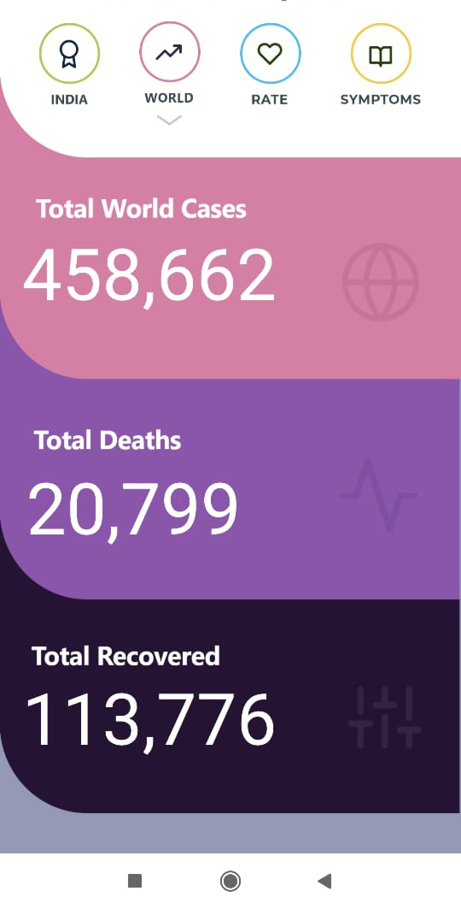
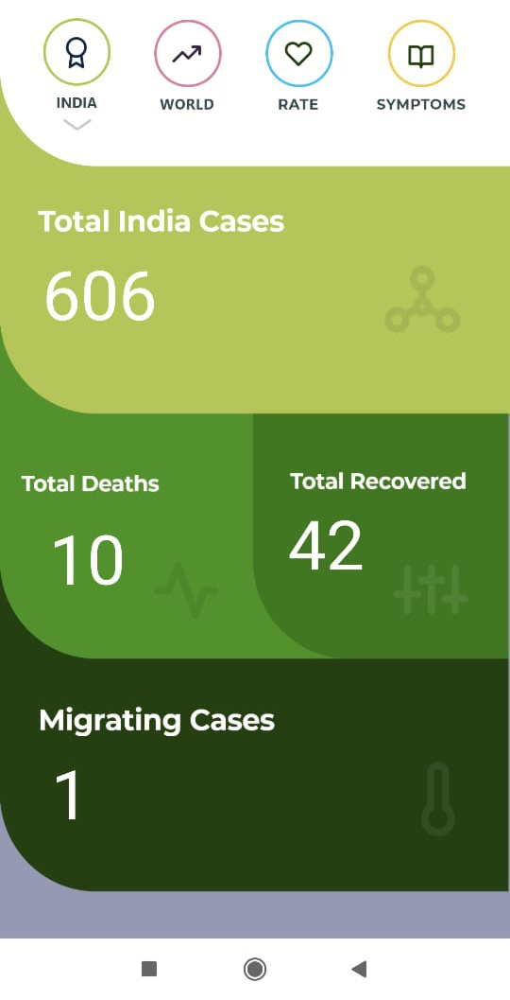
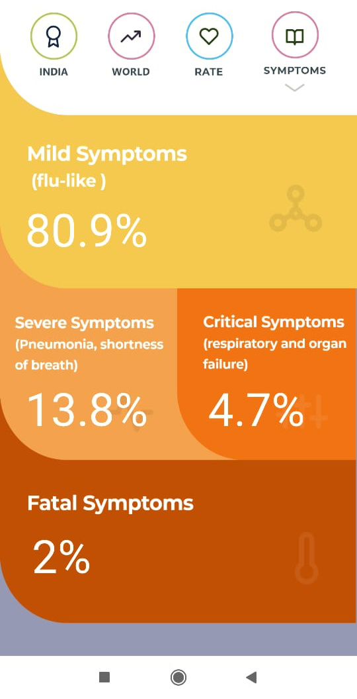
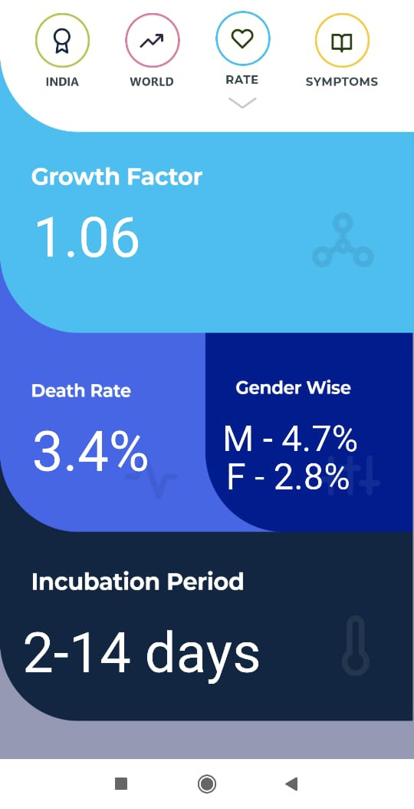

# corona-live
App/website to fetch and show useful information to the masses about COVID-19 pandemic.
Made this app in 2 days, using Java, Android Studio and jSoup library for scraping data from live goverment websites.

{ width=50% }

